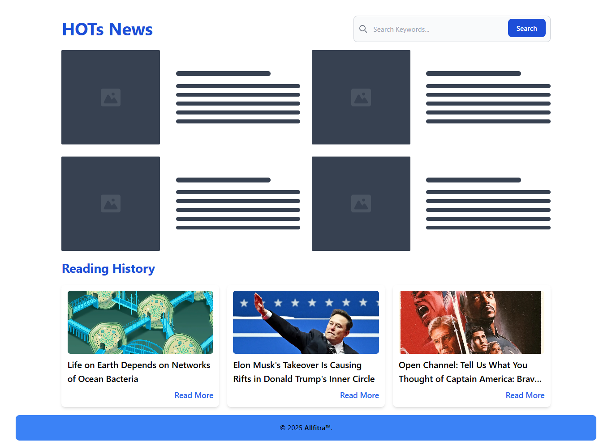
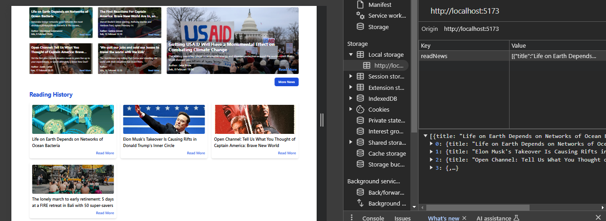

# FrontEnd test Digital Nayaka Abhinaya

## 🚀 Tech Stack

- Vue 3 - Frontend framework
- Tailwind CSS - Styling
- NewsAPI.org - News source
- Vite - Fast development build

## ⚙ Usage

- 🏠 Homepage: Displays the latest news in a structured layout
- 🔍 Search: Enter a keyword to filter news
- 📜 Reading History:
  - Click on Read More to open an article
  - The article will be saved in History
  - History persists even after refreshing the page

## 📸 ScreenShot hasil running

### Halaman Utama

### Halaman utama dengan pencarian "indonesia"

### Halamat utama ketika loading data

### Simpan data history membaca di localhost

### Halaman untuk menampilkan semua data berita

## SALAM HANGAT

Allfitra Fadjri
